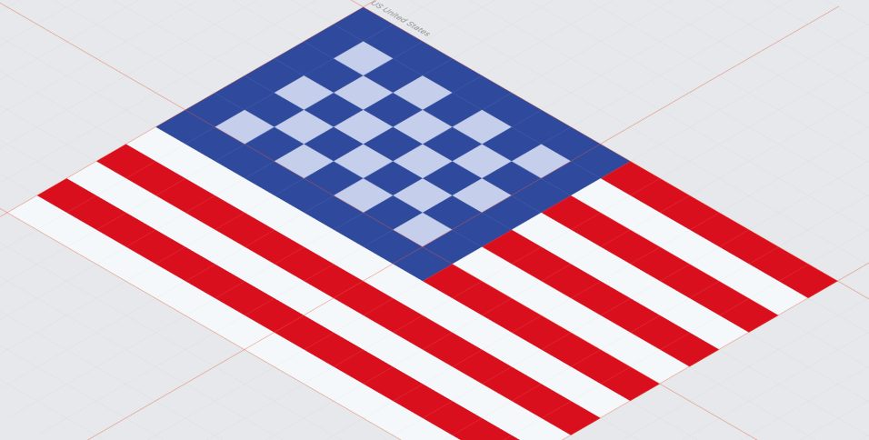
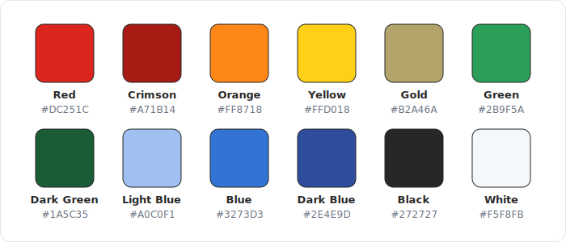

# Pixel Flags



A free set of **200 country (and a few extra) flags** drawn as crisp little pixel icons, **16 × 12 px**. Built for tight spaces — language switchers, leaderboards, address forms, data tables, status bars — anywhere a full-detail flag would turn to mush.

**[Browse the full set in the gallery →](https://tgines.github.io/pixel-flags/)** · install with `npm i pixel-flags`, or load any flag straight from a CDN — no install required.

Every flag ships in three formats so you can drop it into a website, an app, or a design file without converting anything:

| Folder | Format | Size | Best for |
| --- | --- | --- | --- |
| [`svg/`](svg) | SVG (vector) | scales to any size | the web, retina, design tools |
| [`png/`](png) | PNG | 16 × 12 px | pixel-perfect 1× raster use |
| [`png-2x/`](png-2x) | PNG | 32 × 24 px | retina / high-DPI raster use |

## Why pixel flags?

Real flags are full of fine detail — coats of arms, stars, crescents, fine stripes. Shrink one to 16 px and it smears into noise. These are hand-tuned to stay **legible at icon size**: each is a tidy little 16 × 12 composition that still reads as the right country at a glance, and the SVGs stay sharp at any scale.

## File naming

Files are named **`<code>-<name>.<ext>`**, lowercase and hyphenated — the code is the [ISO 3166-1 alpha-2](https://en.wikipedia.org/wiki/ISO_3166-1_alpha-2) country code, so you can build a path straight from a code you already have:

```
svg/br-brazil.svg
png/kr-south-korea.png
png-2x/st-sao-tome-and-principe.png
```

A few entries fall outside ISO: the EU uses its reserved `eu`, England uses the subdivision code `gb-eng`, and Mars has no code (just `mars.svg`). See the [full list](#coverage) for every code.

## Usage

**Install** with npm — the package ships the `svg/`, `png/`, and `png-2x/` folders plus [`flags.json`](flags.json):

```bash
npm i pixel-flags
```

**CDN** — every flag is served by jsDelivr, no install or build step required:

```html

```

Swap `@main` for a release tag like `@1.0.0` to pin an immutable version.

**HTML**

```html

```

**CSS background**

```css
.flag-brazil {
  width: 16px;
  height: 12px;
  background: url("svg/br-brazil.svg") no-repeat center / contain;
}
```

**Markdown**

```markdown

```

**React** — when you have an ISO code from your data:

```jsx

```

## Machine-readable index

Every flag is listed in [`flags.json`](flags.json) with its code, name, slug, and the path to each format — one file you can fetch to enumerate the whole set programmatically. Handy for build scripts, design tooling, and AI agents wiring up flags from an ISO code:

```json
{
  "code": "br",
  "name": "Brazil",
  "slug": "br-brazil",
  "svg": "svg/br-brazil.svg",
  "png": "png/br-brazil.png",
  "png2x": "png-2x/br-brazil.png"
}
```

```js
const { flags } = await fetch(
  "https://raw.githubusercontent.com/tgines/pixel-flags/main/flags.json"
).then((r) => r.json());

const brazil = flags.find((f) => f.code === "br");
// https://cdn.jsdelivr.net/gh/tgines/pixel-flags@main/svg/br-brazil.svg
```

## Coverage

200 flags spanning every region, plus a handful of extras (the EU, England, Puerto Rico, Vatican City — and Mars, for fun).


<details>
<summary><strong>Full A–Z list (with codes)</strong></summary>

Afghanistan `af`, Albania `al`, Algeria `dz`, Andorra `ad`, Angola `ao`, Antigua and Barbuda `ag`, Argentina `ar`, Armenia `am`, Australia `au`, Austria `at`, Azerbaijan `az`, Bahamas `bs`, Bahrain `bh`, Bangladesh `bd`, Barbados `bb`, Belarus `by`, Belgium `be`, Belize `bz`, Benin `bj`, Bhutan `bt`, Bolivia `bo`, Bosnia Herzegovina `ba`, Botswana `bw`, Brazil `br`, Brunei `bn`, Bulgaria `bg`, Burkina Faso `bf`, Burundi `bi`, Cambodia `kh`, Cameroon `cm`, Canada `ca`, Cape Verde `cv`, Central African Republic `cf`, Chad `td`, Chile `cl`, China `cn`, Colombia `co`, Comoros `km`, Congo `cg`, Costa Rica `cr`, Croatia `hr`, Cuba `cu`, Cyprus `cy`, Czechia `cz`, Denmark `dk`, Djibouti `dj`, Dominica `dm`, Dominican Republic `do`, DR Congo `cd`, East Timor `tl`, Ecuador `ec`, Egypt `eg`, El Salvador `sv`, England `gb-eng`, Equatorial Guinea `gq`, Eritrea `er`, Estonia `ee`, Eswatini `sz`, Ethiopia `et`, European Union `eu`, Fiji `fj`, Finland `fi`, France `fr`, Gabon `ga`, Gambia `gm`, Georgia `ge`, Germany `de`, Ghana `gh`, Greece `gr`, Grenada `gd`, Guatemala `gt`, Guinea `gn`, Guinea Bissau `gw`, Guyana `gy`, Haiti `ht`, Honduras `hn`, Hungary `hu`, Iceland `is`, India `in`, Indonesia `id`, Iran `ir`, Iraq `iq`, Ireland `ie`, Israel `il`, Italy `it`, Ivory Coast `ci`, Jamaica `jm`, Japan `jp`, Jordan `jo`, Kazakhstan `kz`, Kenya `ke`, Kiribati `ki`, Kosovo `xk`, Kuwait `kw`, Kyrgyzstan `kg`, Laos `la`, Latvia `lv`, Lebanon `lb`, Lesotho `ls`, Liberia `lr`, Libya `ly`, Liechtenstein `li`, Lithuania `lt`, Luxembourg `lu`, Madagascar `mg`, Malawi `mw`, Malaysia `my`, Maldives `mv`, Mali `ml`, Malta `mt`, Mars `—`, Marshall Islands `mh`, Mauritania `mr`, Mauritius `mu`, Mexico `mx`, Micronesia `fm`, Moldova `md`, Monaco `mc`, Mongolia `mn`, Montenegro `me`, Morocco `ma`, Mozambique `mz`, Myanmar `mm`, Namibia `na`, Nauru `nr`, Nepal `np`, Netherlands `nl`, New Zealand `nz`, Nicaragua `ni`, Niger `ne`, Nigeria `ng`, North Korea `kp`, North Macedonia `mk`, Norway `no`, Oman `om`, Pakistan `pk`, Palau `pw`, Palestine `ps`, Panama `pa`, Papua New Guinea `pg`, Paraguay `py`, Peru `pe`, Philippines `ph`, Poland `pl`, Portugal `pt`, Puerto Rico `pr`, Qatar `qa`, Romania `ro`, Russia `ru`, Rwanda `rw`, Saint Kitts and Nevis `kn`, Saint Lucia `lc`, Saint Vincent `vc`, Samoa `ws`, San Marino `sm`, Saudi Arabia `sa`, Senegal `sn`, Serbia `rs`, Seychelles `sc`, Sierra Leone `sl`, Singapore `sg`, Slovakia `sk`, Slovenia `si`, Solomon Islands `sb`, Somalia `so`, South Africa `za`, South Korea `kr`, South Sudan `ss`, Spain `es`, Sri Lanka `lk`, Sudan `sd`, Suriname `sr`, Sweden `se`, Switzerland `ch`, Syria `sy`, São Tomé and Príncipe `st`, Tajikistan `tj`, Tanzania `tz`, Thailand `th`, Togo `tg`, Tonga `to`, Trinidad and Tobago `tt`, Tunisia `tn`, Turkey `tr`, Turkmenistan `tm`, Tuvalu `tv`, Uganda `ug`, Ukraine `ua`, United Arab Emirates `ae`, United Kingdom `gb`, United States `us`, Uruguay `uy`, Uzbekistan `uz`, Vanuatu `vu`, Vatican City `va`, Venezuela `ve`, Vietnam `vn`, Yemen `ye`, Zambia `zm`, Zimbabwe `zw`

</details>

## Contributing

Spotted a flag that needs fixing, or want to add one that's missing? Open an issue or a pull request. Please keep new flags to the same **16 × 12 px** grid and provide all three formats (`svg`, `png`, `png-2x`) so the set stays consistent.

After adding the files and an entry to the A–Z list above, run `npm run build` to regenerate [`flags.json`](flags.json) and the gallery — a check that also verifies every flag has all three formats.

### Palette

Flags are drawn from a shared 12-color palette. Reuse these so new flags stay cohesive with the set — reach for the closest existing swatch rather than introducing a new shade.



| Color | Hex | | Color | Hex |
| --- | --- | --- | --- | --- |
| Red | `#DC251C` | | Green | `#2B9F5A` |
| Crimson | `#A71B14` | | Dark Green | `#1A5C35` |
| Orange | `#FF8718` | | Light Blue | `#A0C0F1` |
| Yellow | `#FFD018` | | Blue | `#3273D3` |
| Gold | `#B2A46A` | | Dark Blue | `#2E4E9D` |
| Black | `#272727` | | White | `#F5F8FB` |

## License

[MIT](LICENSE) — free to use in personal and commercial projects, no attribution required (though it's always appreciated).

Flags are emblems of their respective nations and are reproduced here for identification purposes.
